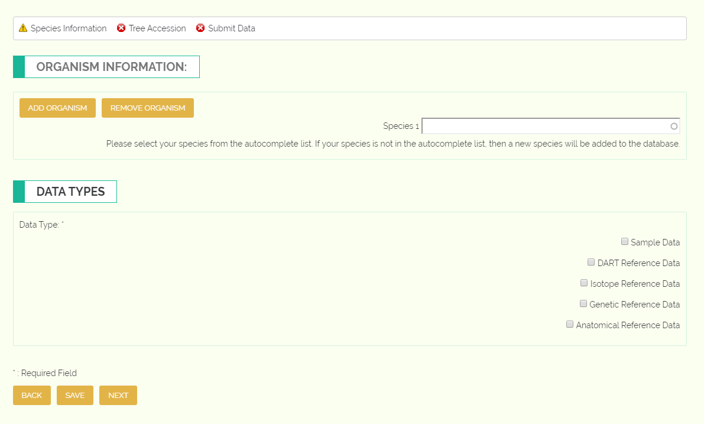

*************************************************
Example GTTN-TPPS Submission: Species Information
*************************************************

The first set of fields in GTTN-TPPS allows the user to specify the species of trees that their data will reference, as well as the type of data they will be submitting.

The species name textfields provide the user with autocomplete options while they type the name of each species.
