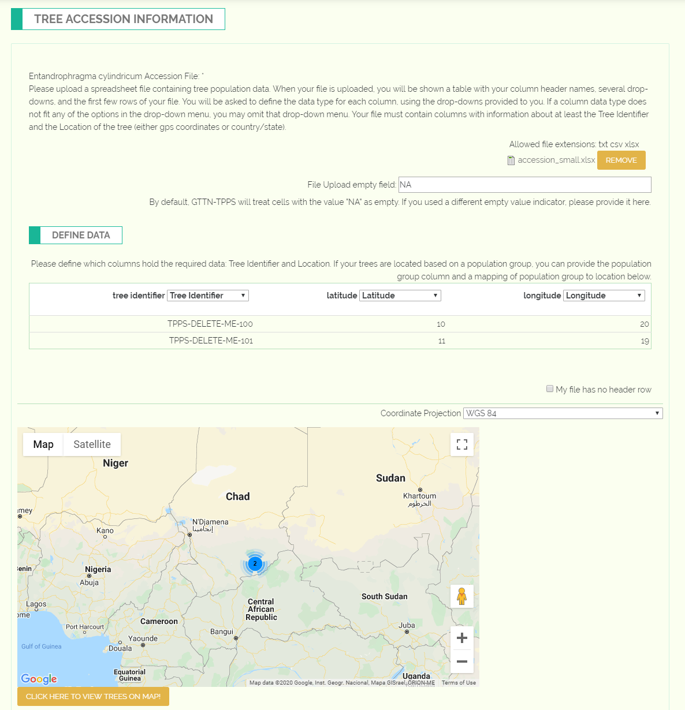

********************************************
Example GTTN-TPPS Submission: Tree Accession
********************************************

The second set of fields in GTTN-TPPS allows the user to specify the locations of each individual tree they are submitting data for. The user will have the option to use gps coordinates or country/state/county/district.

Once the user has submitted an accession file and defined their tree identifier, latitude, and longitude columns, they will be able to view their tree locations on a map.

