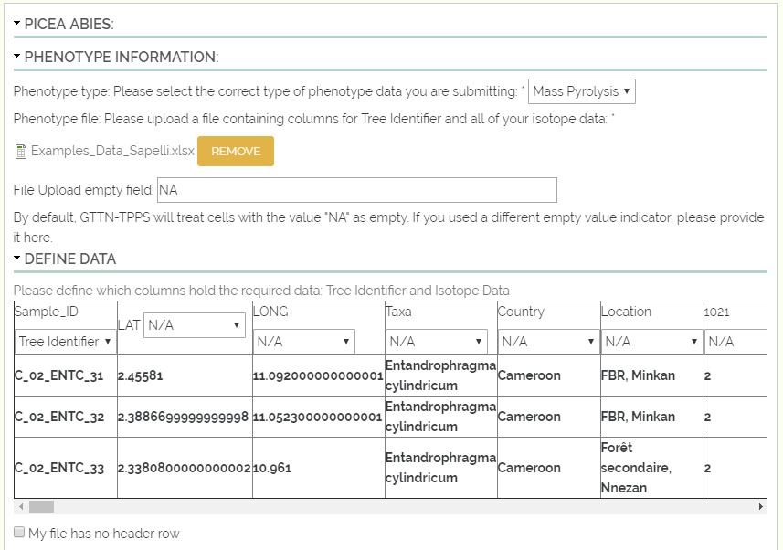
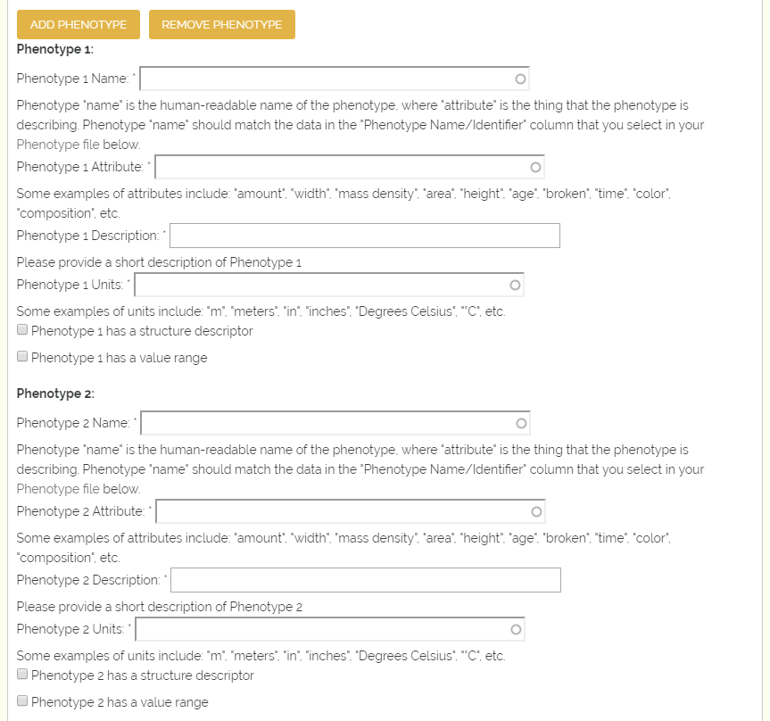
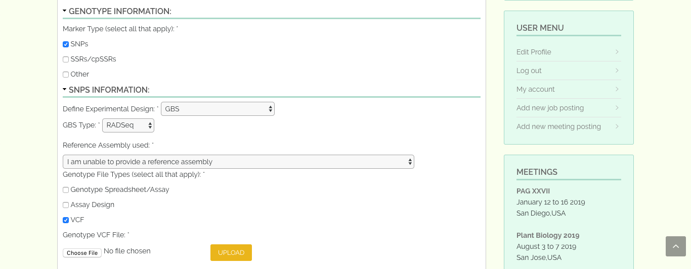

*****************************************
Example GTTN-TPPS Submission: Submit Data
*****************************************

The third set of fields in GTTN-TPPS is where the user must submit their actual genotype and/or phenotype data, depending on the type of data they specified on the Species Information page.

If the user selected phenotype data as one of their data types, then they will be required to upload their phenotype data file.

The user can also optionally provide phenotype data manually.

If the user selected genotype data as one of their data types, then they will be required to specify the type of genotype marker and type of genotype file(s), and upload their genotype file(s).

