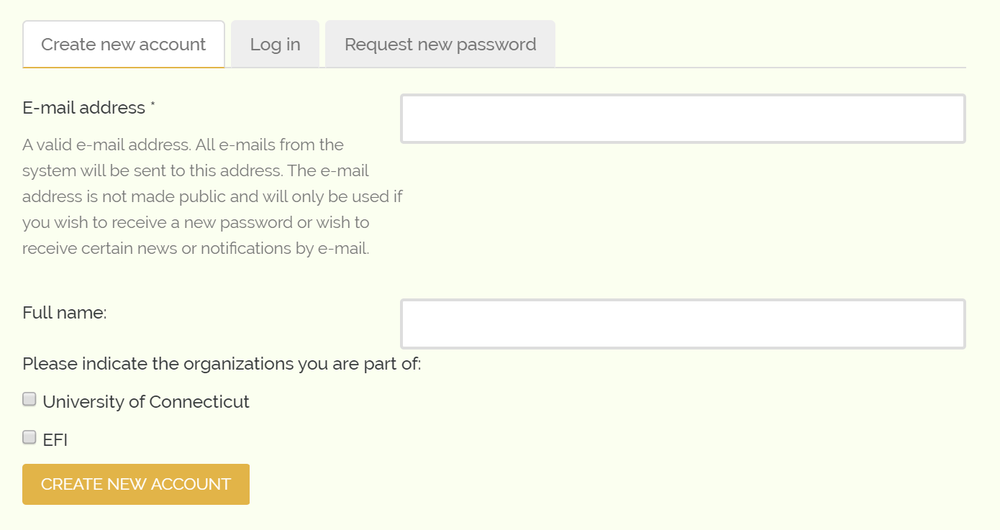

Creating an Account
-------------------

Before we can start submitting data through the form, we must create an account so that GTTN-TPPS knows who is submitting data and which organization that data is coming from. To create an account, navigate to `gttn.treegenesdb.org/user/register`_.

You will be asked to provide your full name, your email address, and indicate which organizations you are a part of:

After you have provided all of the required information, an admin will need to approve your account and the primary contacts of each organization you indicated will need to verify that you are part of that organization. Once your account has been approved and verified, you should receive an email notification and you will be able to set a password and log in.

.. _gttn.treegenesdb.org/user/register: https://gttn.treegenesdb.org/user/register
