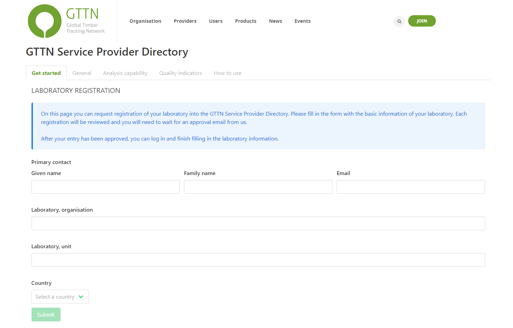

Creating an Account
-------------------

Before we can start submitting data through the form, we must create an account so that GTTN-TPPS knows who is submitting data and which organization that data is coming from. To create an account, navigate to `gttn.treegenesdb.org/user/register`_.

You will be asked to provide your full name, your email address, and indicate which organizations you are a part of:

After you have provided all of the required information, an admin will need to approve your account and the primary contacts of each organization you indicated will need to verify that you are part of that organization. Once your account has been approved and verified, you should receive an email notification and you will be able to set a password and log in.

Once you are logged in, you will have access to a variety of new data, depending on which organizations you claimed membership. Data that is public to GTTN organizations, data that has been shared with organizations that you are a member of, and data that has been shared with your user roles will now become available.

User Roles
----------

There are three default user roles that are important to understanding data access, and there are also some special roles that give users special permissions. We will discuss all of the roles currently available on `gttn.treegenesdb.org`_ here:

Default user roles:

 * Anonymous: This role is automatically assigned to anyone who is not yet logged in to the GTTN site. This will restrict data access to collections that have been marked as available to the public.
 * Authenticated: This role is assigned to anyone who is now logged in to the GTTN site. Having this role allows the user to see all of the same information as the "Anonymous" role, as well as collections that have been marked as available to the entire GTTN network, **and** collections that have been marked as available to organizations which the user is a part of.
 * Administrator: This role is only given to site administrators, usually limited to those who work on developing the code of the site. This role allows users to browse all data on the site, regardless of membership in an organization.

Custom user roles:

These roles are for users who serve a special purpose in the GTTN community, and usually result in access to additional data:

 * Law Enforcement: This role describes users who are verified law enforcement officers. Having this role allows the user to see all of the same information as the "Authenticated" role, as well as collections that have been marked as available only to law enforcement users.

Please note that the access that these roles provide is subject to change, and additional custom user roles are likely to be added in the future!

.. _gttn.treegenesdb.org: https://gttn.treegenesdb.org

.. _gttn.treegenesdb.org/user/register: https://gttn.treegenesdb.org/user/register
