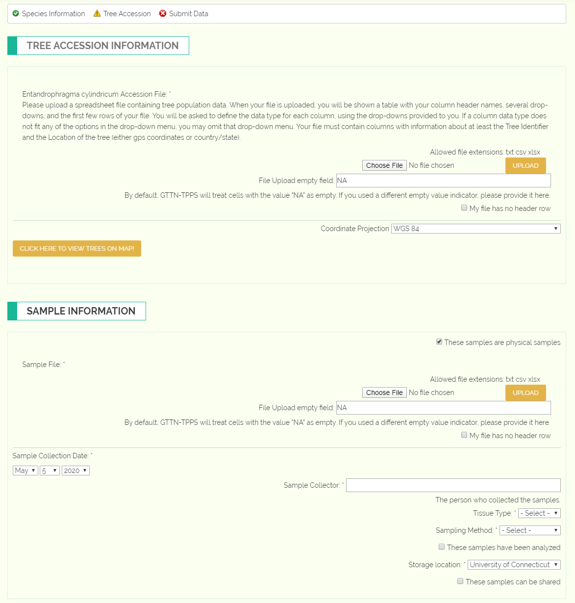
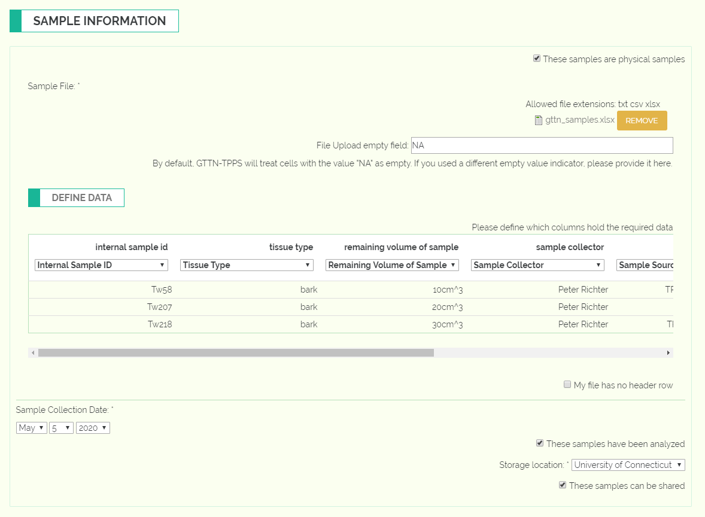

Location Information
--------------------

This page will collect location information for the trees you are using in this submission, as well as sample information if you indicated you were providing sample data in the previous page.

Tree Accession Information
**************************

This section will require one or more tree accession files:

.. image:: ../../../images/tree_accession.png

The simplest tree accession file will simply require a tree identifier column, and location columns such as latitude/longitude, or country/state. However, if your accession file contains trees from multiple species, you will also need columns that indicate which species a tree is from. If you do not have the exact locations for your trees and instead have population groups, you can indicate a population group column, and you will be prompted to indicate the location of each population group below the file field.

If you have properly filled out the column types for tree identifier and location, you will be able to view your data in a thumbnail map by clicking "Click here to view trees on map!". This is useful for verifying that the locations you have uploaded are being interpreted correctly by GTTN-TPPS.

Sample Information
******************

This section requires a sample file:

This section requires a variety of information about each sample you are submitting. The sample file you provide must contain the following columns:

 * Internal Sample ID or Xylarium ID
 * Sample Source - Which tree or other sample does this sample come from?
 * Sample Dimensions - What are the LxWxH dimensions of the sample?
 * Remaining Volume of Sample - How much of the sample is left?

You will then need to provide this information in either a file column or by filling out the fields below the file upload field:

 * Collection Date - The date the sample was collected
 * Sample Collector - The person who collected the sample
 * Sample Tissue - The type of tissue the sample is. This is usually bark, heartwood, leaf, etc.
 * Sampling Method - The method of collecting the sample. This is either increment core, punch, disc, or cube.
 * Analyzed - Whether or not the sample has already been analyzed.
 * Storage Location - The location where the sample is being stored. This is how GTTN keeps track of the inventory of each organization and the location of each sample.

Finally, you will need to indicate whether the samples can be shared with other organizations.
