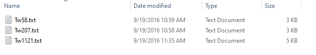

Reference and Analysis Data
---------------------------

This page contains reference and analysis data. The contents of the form depend on the selections made on the Species and Data Type Information page.

Direct Analysis in Real Time (DART)
***********************************

This section collects information about a DART analysis:

.. image:: ../../../images/dart_information.png

To upload DART information, you will need a top-level DART data file, and a compressed DART Raw Data file.

Top-Level DART Data File
########################

The top-level DART file will contain an entry for each sample analyzed in the DART submission, and each entry must include the following information:

 * Sample Internal ID or Xylarium ID
 * Analysis Lab Name - The lab that performed the DART analysis.
 * Analysis Lab Spectra ID
 * Spectra Gatherer
 * Type of DART TOFMS
 * Parameter Settings - The parameter settings on the DART machine used for analysis.
 * Calibration Type

Here is an example top-level DART data file:

Compressed DART Raw Data File
#############################

The compressed DART Raw Data file should be a .zip, .tar, or .gz file which is a compressed foler of plain text files. Each text file should contain the DART spectra for one sample. Here is an example of the uncompressed foler:

Note that each file name is of the format ``<sample ID>.txt``. This is important for identifying which file is associated with which sample. The file itself should be a collection of weights and peaks, which is the raw DART data:

The file should be in the format::

    <Title>
    <DART Configuration>

    <weight>\t<peak>
    [<weight>\t<peak>...]

Isotope
*******

This section collects information about an Isotope analysis:

You will be required to indicate which isotopes you used, which isotope standard you used for each isotope, and the type of each isotope (whole wood or cellulose). You will then be required to provide an isotope data file, which contains an entry for each analyzed sample. Each entry must contain a column with the sample ID, and a column with the measurement for each isotope used. GTTN-TPPS accepts two formats of an isotope data file - one with separate column for each isotope (example on the left below) and another with 3 columns: sample ID, isotope and measurement (example on the right):

Genetics
********

This section collects information about a Genetic analysis:

For all genetic information, you will need to provide the DNA Quality Score.

The contents of the form in this section vary greatly depending on the type of genetic analysis and the type of genetic markers used.

SNPs
####

For SNP data, you will first need to identify the source of your SNPs, either GBS, Reference Genome, Transcriptome, or Genotype Assay.

If you selected GBS as your source, you will need to provide the following:

 * GBS Type (ddRad, RAD, NextRad, etc)
 * GBS Sequencing Instrument name
 * GBS Intermediate reference file: either select a reference file from the list of existing reference files on the GTTN Server, or upload your own reference file.
 * GBS Alignment file
 * VCF File

If you selected Assay as your source, you will need to provide the following:

 * Assay Source (MassArray, Illumina, Thermo)
 * Assay Design File
 * Assay Genotype Table

SSRs/cpSSRs
###########

For microsatellite data, you will need to provide the name of the Sequencing Instrument you used for your analysis, as well as the ploidy of the organism you are analyzing and an SSR spreadsheet containing all of the raw SSR data.

Wood Anatomy
************

This section collects information about a Wood Anatomy analysis:

.. image:: ../../../images/anatomy_information_1.png

We collect metadata for each species based on the IAWA standards: Nomenclature, General, Vessels, Tracheids and fibres, Axial parenchyma, Rays, Storied structures, Mineral inclusions, Physical and chemical tests.

You can upload any number of microscope slide images and provide brief descriptions for each.
