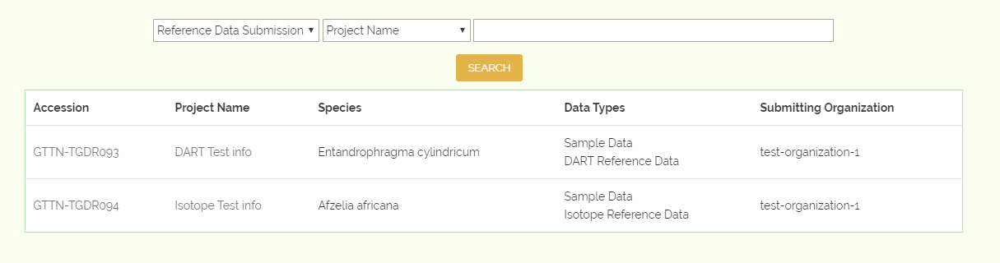
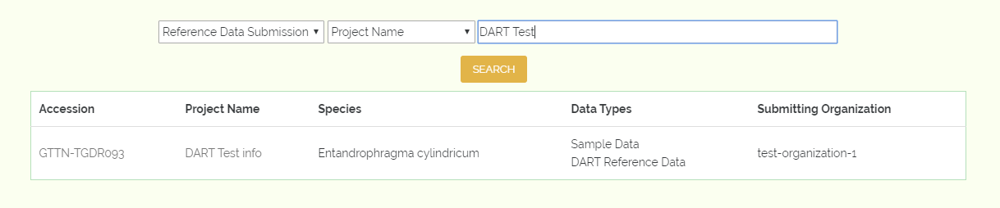
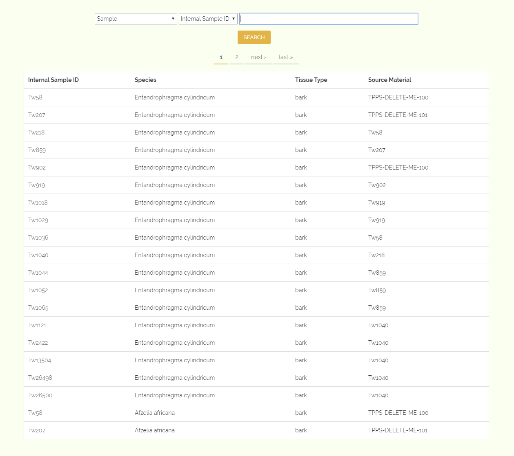
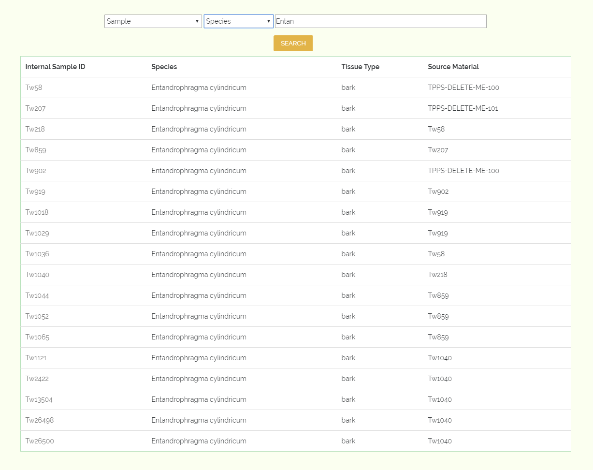

Reference and Sample Data Search Form
=====================================

To browse and search reference data that has been uploaded through GTTN-TPPS, we use the reference and sample data search form. The form can be found at `gttn.treegenesdb.org/reference`_.

While the form is still a work in progress, the prototype currently available should be able to give an idea of what might be available in the future.

Currently, there are two possible data types to search by: Reference Data Submissions and Sample Data. We plan to expand this search form so that it is possible for users to search for different data types, filter by different criteria, and access detail views which include the full list of data for elements retruned by the search.

Reference Data Submissions
--------------------------

To browse all reference data submissions, select "Reference Data Submission" from the first drop-down menu, then click "Search". If the text field is left blank, then the search results will include every available Data submission that has been approved from GTTN-TPPS:

Here we can see some brief data about the submissions that matched our search.

We can currently filter submissions by project name, species, data type, or submitting organization for example, if we enter something like "DART Test" to the textfield and click search, the form will return only the submissions with the phrase "DART Test" in the project name:

Sample Data
-----------

Similar to the Reference Data Submissions, you can browse all samples by selecting "Sample" from the first drop-down menu, then clicking "Search":

We can currently filter by Sample ID and species. To search by species, simply select "Species" from the second drop-down menu, and enter something like "Entan" to the textfield and click search, the form will return only the samples which are from a species whose name contains "Entan":

.. _gttn.treegenesdb.org/reference: http://gttn.treegenesdb.org/reference
