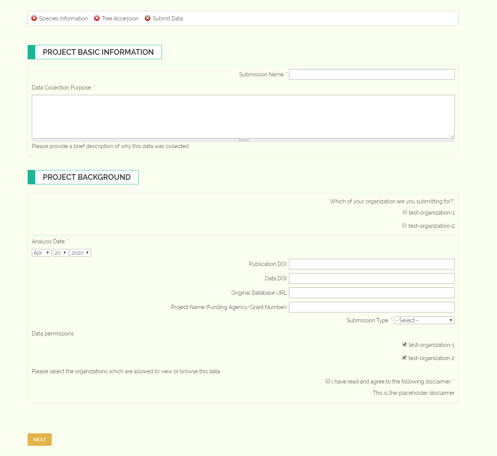

Landing Page and Submission Type
--------------------------------

Now that you have created an account and have successfully logged in, you can start submitting data through the data collection pipeline! Navigate to `gttn.treegenesdb.org/gttn-tpps`_ in your browser and you will see the landing page. If this is your first time submitting data then your only option will be to create a new GTTN-TPPS Submission, but if you have saved incomplete submissions, you will be able to choose to load one of those submissions:

Click "Continue to GTTN-TPPS" and you will see the Submission Type page. This page collects some metadata about the data submission and the higher level project funding, where applicable:

Required fields will be marked with an asterisk. The Submission name under Project Basic Information is the name of the data collection that you will be submitting, for example if you were submitting a DART analysis, you might name your submission something like "DART Analysis 1". The Project Name under the Project Background section is the name of the higher level project or the NSF grant number. This field is not necessary but can make your data easier to find in the future.

If you are a member of more than one organization, you will need to indicate which organization you are submitting this data for. This is important for keeping track of the sample inventory of each organization in the GTTN group.

GTTN needs to know the type of trees and samples you will be submitting - if they already exist in the GTTN database or if they are brand new. This information is collected through the "Submission Type" field.

You will then need to select which organizations are allowed to see the data in the "Data Permissions" field. If you opt not to select any organizations, then the data you provide through this submission will be visible only to you.

.. _gttn.treegenesdb.org/gttn-tpps: https://gttn.treegenesdb.org/gttn-tpps
